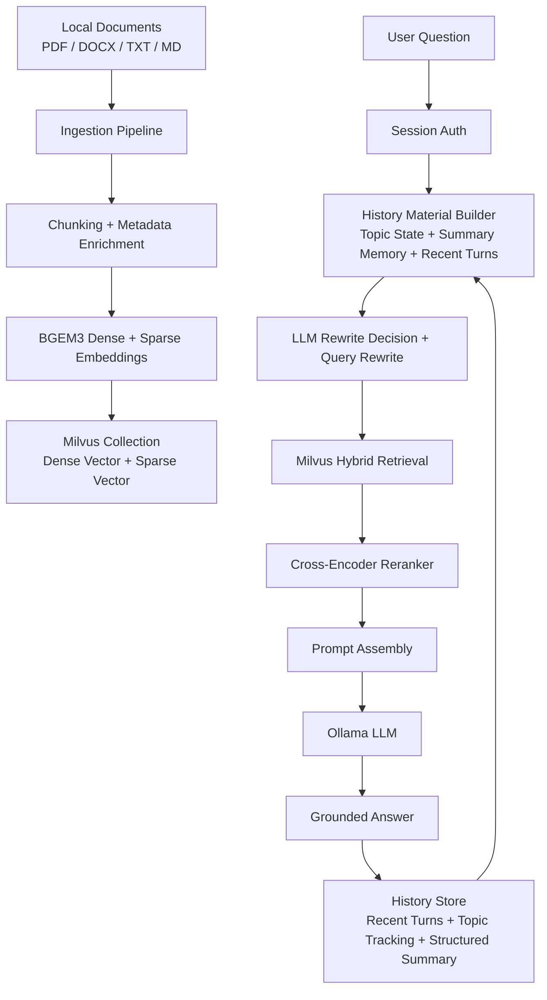

# Pet Doctor - Intelligent Question Answerer

A domain-specific RAG application for pet health Q&A, built as a full backend product rather than a single notebook demo.

This project combines document ingestion, hybrid retrieval, reranking, multi-turn memory, history-aware query rewriting, local LLM answering, user authentication, and evaluation into one end-to-end system.

## Interviewer Snapshot

This repository demonstrates that I can build more than a prompt wrapper.

- I implemented a full RAG pipeline around real product constraints: retrieval quality, answer grounding, auth, sessions, admin operations, and evaluation.
- I built a structured multi-turn memory layer with topic tracking, summary memory, and history-aware query rewriting so follow-up questions such as "Is it dangerous?" or "What about vomiting?" can be resolved from prior turns.
- I integrated Milvus hybrid search with dense + sparse retrieval, then added cross-encoder reranking to improve final context quality.
- I included offline ingestion and evaluation scripts so the system can be measured, not just manually demoed.

## Project Overview

Pet Doctor is a pet-health assistant that answers questions from a domain corpus rather than from the LLM's parametric memory alone.

The current system:

- loads local veterinary reference documents
- splits them into chunks and enriches them with chapter metadata
- stores dense and sparse vectors in Milvus
- tracks per-user topic state and structured summary memory in-process
- rewrites ambiguous follow-up questions using projected topic state, recent turns, and summary memory
- retrieves relevant chunks with hybrid search
- reranks candidates with a cross-encoder
- generates grounded answers with a local Ollama-hosted model
- exposes the workflow through a FastAPI app with user login, profile pages, and an admin console

This is intentionally designed as an application system, not just a model experiment.

## Why This Project Matters

From an interview perspective, this project shows practical backend and LLM engineering skills across:

- API design with FastAPI
- vector search and retrieval engineering
- ranking and prompt-grounding design
- evaluation with retrieval metrics and RAGAS
- Docker-based local infrastructure
- authentication and role-based access control
- project organization across ingestion, online serving, and offline evaluation

## System Architecture



## Tech Stack

| Layer | Tools | Why It Is Used |
| --- | --- | --- |
| Backend API | FastAPI, Uvicorn | Lightweight and fast Python API framework for serving the app and static frontend |
| Retrieval Framework | LangChain, LangChain Milvus | Orchestration of embeddings, retrieval, and prompt pipeline |
| Vector Database | Milvus, etcd, MinIO | Production-style vector DB stack with explicit index and search parameter control |
| Embeddings | BAAI `bge-m3`, `pymilvus[model]`, `FlagEmbedding` | Supports hybrid dense + sparse retrieval in one retrieval pipeline |
| Reranking | `bge-reranker-v2-m3` via `sentence-transformers` CrossEncoder | Improves precision after initial retrieval |
| LLM Serving | Ollama with `llama3.2` | Local-first generation without relying on a paid online inference path |
| Data Layer | SQLAlchemy, SQLite | User and admin persistence with simple local setup |
| Auth | Session cookies, bcrypt | Practical stateful auth with password hashing and role separation |
| Evaluation | RAGAS, OpenAI embeddings, custom retrieval metrics | Measures both retrieval quality and downstream answer quality |
| Infra | Docker Compose | Runs Milvus stack and app services locally in a reproducible way |

## Core Technical Highlights

### 1. Hybrid Retrieval Instead of Dense-Only Search

The retrieval layer is not limited to semantic dense embeddings.

- `BGE-M3` produces both dense and sparse representations
- Milvus stores `dense_vector` and `sparse_vector` fields in the same collection
- the system supports weighted hybrid ranking and RRF-style fusion
- retrieval parameters are configurable through environment variables rather than hard-coded

Why this matters:

- dense search is good at semantic similarity
- sparse search is better at exact term matching and rare keywords
- hybrid retrieval is a practical compromise for domain QA systems where both matter

### 2. Multi-Turn Memory and History-Aware Query Rewriting

A common failure mode in RAG apps is that users ask short follow-up questions that only make sense in conversation context.

Examples:

- "Is it dangerous?"
- "What about vomiting?"
- "He seems weak and sleepy too."
- "Is that dose okay with this situation?"

This project addresses that with a structured memory design instead of relying on a flat transcript alone.

- `topic_state` tracks fixed pet-health fields such as `pet_type`, `pet_name`, `symptom`, `event`, `food_or_toxin`, `medication`, `timeline`, and `severity`
- `structured_summary_memory` stores longer-lived fields such as `user_reported_facts`, `timeline_events`, `user_actions_taken`, `state_transitions`, and `risk_flags`
- `recent_turns` keeps the latest raw conversation turns for local phrasing and immediate pronoun resolution

The rewrite path now works like this:

- the local LLM emits a structured JSON object with `rewrite_needed`, `reason`, and `rewritten_query`
- rewrite context is built from projected topic-state items, the last two raw turns, and a small whitelist projection from structured summary memory
- after each answer, topic tracking is updated again from the current user turn and rewritten query
- once recent turns exceed the in-memory limit, older turns are summarized into the structured memory table instead of remaining as raw text forever

This keeps follow-up retrieval grounded while reducing noise from stale resolved symptoms or long unstructured chat history.

### 3. History Store Design

The history layer is intentionally split into three different representations because they solve different problems.

- `topic_state` is the current structured case view used mainly for query rewrite
- `structured_summary_memory` is the long-term compact memory created when recent turns roll over
- `recent_turns` is a short raw transcript window for very local wording and immediate references

Current behavior:

- recent turns are stored in-memory per user
- the store keeps up to `10` recent turns before archiving older turns into structured summary memory
- query rewrite only reads the last `2` raw turns, not the entire recent buffer
- multi-value topic fields are projected to a small Top-K view for rewrite so stale items do not dominate retrieval

### 4. Retrieval + Rerank Instead of Retrieval Alone

The system does not trust first-pass vector retrieval as the final answer context.

- Milvus retrieves a broader candidate set
- a cross-encoder reranker rescored the candidate chunks against the user query
- only the strongest contexts are passed into generation

This is important because many practical RAG failures come from "almost right" retrieval that needs better final ordering.

### 5. Metadata-Enriched Ingestion

The ingestion pipeline does more than split raw text.

- supports `pdf`, `docx`, `txt`, and `md`
- maps PDF pages to printed page numbers
- adds chapter metadata during ingestion
- keeps ingestion separate from online serving

This makes the corpus more explainable, easier to evaluate, and easier to debug.

### 6. Product-Like Auth and Role Separation

This project includes user management because a usable assistant is more than a model endpoint.

- public registration creates regular users
- admins are stored separately from users
- session cookies are used for server-side auth
- admin-only routes exist for user management
- static pages are served for landing, chat, profile, and admin views

### 7. Evaluation Loop Built Into the Repository

The repo includes both retrieval and answer-quality evaluation:

- `eval/retrieval_metrics.py` for retrieval-focused scoring
- `eval/ragas_eval.py` for downstream RAG quality checks
- `eval/test_set.json` as a reproducible test set

That matters because it turns the project into an engineering system with measurable iteration, not just a demo.

## Retrieval and Answering Pipeline

1. Documents are loaded from the local `data/` directory.
2. Documents are chunked with overlap for retrieval.
3. Chunks are embedded with `bge-m3`.
4. Dense and sparse vectors are stored in Milvus.
5. A user submits a question through `/ask`.
6. The system builds history material from topic tracking state, structured summary memory, and recent turns.
7. The local LLM decides whether the question needs rewriting and returns a structured rewrite result.
8. If the rewrite is safe, Milvus runs hybrid retrieval on the rewritten standalone query.
9. Retrieved chunks are reranked with a cross-encoder.
10. The top contexts are inserted into a constrained prompt.
11. Ollama generates a short grounded answer.
12. The raw user and assistant turn is appended to recent conversation history.
13. If recent-turn history reaches the configured limit, older turns are summarized into the structured memory table.
14. Topic tracking is updated from the current user query plus the rewritten query for use in later turns.

## Evaluation Snapshot

Current repository snapshot includes both retrieval and RAG evaluation outputs.

### Retrieval Metrics

On the current 55-question test set using chapter-level relevance:

| Metric | Value |
| --- | --- |
| Macro Precision@4 | `0.7409` |
| Macro Recall@4 | `1.0000` |
| Macro F1@4 | `0.8336` |

### RAGAS Metrics

Current `eval/ragas_results.json` snapshot:

| Metric | Value |
| --- | --- |
| Faithfulness | `0.9125` |
| Answer Relevancy | `0.7516` |
| Context Precision | `0.9197` |
| Context Recall | `0.7679` |

These numbers should be read as an evaluation baseline, not as a final production claim.

## Repository Structure

```text
.
├── app
│   ├── core                # settings and device selection
│   ├── db                  # SQLAlchemy engines and models
│   ├── deps                # auth, container wiring, hybrid Milvus helpers
│   ├── pipeline            # query rewrite logic
│   ├── routes              # auth, QA, user, health endpoints
│   ├── services            # RAG, retrieval, history, user services
│   └── static              # landing page, chat UI, profile UI, admin UI
├── data                    # local domain documents
├── eval                    # test set and evaluation scripts
├── ingest.py               # offline ingestion script
├── docker-compose.yml      # Milvus stack + app service
└── requirements.txt
```

## Local Development Setup

### Prerequisites

- Python 3.11+ recommended
- Docker and Docker Compose
- Ollama installed locally
- optional OpenAI API key for RAGAS evaluation

### 1. Install Python Dependencies

```bash
python -m venv .venv
source .venv/bin/activate
pip install -r requirements.txt
```

### 2. Start Infrastructure

Recommended development workflow:

- run the application locally
- run Milvus infrastructure in Docker

```bash
docker compose up -d etcd minio milvus
```

If you want the app container too:

```bash
docker compose up --build -d
```

### 3. Start the Local LLM

```bash
ollama pull llama3.2
ollama serve
```

### 4. Configure Environment Variables

Create a `.env` file in the project root if needed.

Common variables:

```env
SESSION_SECRET_KEY=change-me
ADMIN_SEED_USERNAME=admin
ADMIN_SEED_EMAIL=admin@petdoctor.com
ADMIN_SEED_PASSWORD=admin123456
MILVUS_URI=http://localhost:19530
OLLAMA_BASE_URL=http://localhost:11434
HF_EMBED_MODEL=BAAI/bge-m3
RAG_HYBRID_ENABLED=true
OPENAI_API_KEY=your-key-for-ragas-only
```

### 5. Ingest the Corpus

```bash
python ingest.py
```

### 6. Run the API

```bash
uvicorn app.main:app --reload
```

Then open:

- `http://localhost:8000/`
- `http://localhost:8000/chat`
- `http://localhost:8000/profile`
- `http://localhost:8000/admin`

## Main Endpoints

| Endpoint | Method | Purpose |
| --- | --- | --- |
| `/register` | `POST` | Create a user account |
| `/login` | `POST` | User login |
| `/admin/login` | `POST` | Admin login |
| `/me` | `GET` | Return current authenticated user |
| `/ask` | `POST` | Main question-answering endpoint |
| `/users/` | `GET` | Admin-only user listing |
| `/users/{id}` | `GET/PUT/DELETE` | User profile management with role checks |

## Evaluation Commands

### Retrieval Evaluation

```bash
python eval/retrieval_metrics.py --k 4
```

### RAGAS Evaluation

```bash
python eval/ragas_eval.py --k 4
```

Notes:

- RAGAS evaluation requires `OPENAI_API_KEY`
- retrieval evaluation runs against the same local retrieval stack used by the app

## Design Decisions and Trade-Offs

### Why Structured Multi-Turn Memory Instead of Only Raw Chat History

Relying on the last N raw turns alone makes rewrite unstable once a conversation gets longer.

- older raw turns keep stale symptoms alive even after the user says they are resolved
- raw turns mix user facts, assistant guidance, and conversational filler in one channel
- short references like "it" or "that dose" need both local phrasing and structured entities

The current design separates those concerns:

- topic tracking captures the current structured case state
- recent turns preserve the most local phrasing
- structured summary memory keeps longer-term facts after recent turns roll over

This is still process-local and not yet durable storage, but it is a better retrieval context than a flat transcript alone.

### Why Milvus Instead of a Simpler In-Memory Vector Store

I wanted explicit control over:

- vector fields
- hybrid retrieval
- indexing strategy
- search parameters

That makes the project closer to a production retrieval system than a toy notebook built around a default in-memory vector store.

### Why Session Cookies Instead of JWT

For this project, server-side sessions were the simpler and more practical choice.

- easier local development
- straightforward role checks
- easy logout and session invalidation

JWT would make more sense for a distributed multi-service deployment, but it would add complexity that this project did not need yet.

### Why Local Ollama Instead of a Hosted LLM API

Using Ollama keeps the online serving path local-first:

- lower cost during development
- easier offline experimentation
- clearer separation between retrieval quality and model API spend

I still use OpenAI in the evaluation pipeline because RAGAS metrics benefit from a stronger judge model.

## Current Limitations

I consider these important to state clearly in an interview setting.

- Multi-turn memory is currently process-local and in-memory, not persisted in a database.
- The history layer is scoped to one active continuous conversation per user; there is no `conversation_id` isolation yet.
- Topic tracking and summary memory both depend on structured local-LLM outputs, so schema drift still needs tighter guardrails.
- Neo4j is provisioned in Docker but is not yet integrated into the online retrieval path.
- Retrieval evaluation is currently chapter-level; section-level or span-level relevance would be a stronger benchmark.
- The system is a pet-health information assistant, not a veterinary diagnosis system.
- Prompting is safety-aware, but this is still not a replacement for professional medical advice.

## What I Would Build Next

- persist topic state, structured summary memory, and recent turns in a database instead of process memory
- add explicit `conversation_id` support so users can keep multiple isolated case threads
- tighten validation and observability around structured rewrite/topic-tracking outputs
- add citation-aware responses with explicit source snippets and metadata
- compare dense-only, hybrid, and rerank configurations with stricter offline A/B evaluation
- add section-level retrieval labels for more sensitive retrieval measurement
- integrate Neo4j as an optional graph augmentation path for structured relationships
- add streaming responses and more robust observability

## Default Admin Seed

The app seeds an admin account on startup.

```text
username: admin
email: admin@petdoctor.com
password: admin123456
```

Change these values before any real deployment.

## Summary

This project is best understood as a complete domain-RAG backend application with:

- hybrid retrieval
- structured multi-turn memory
- reranking
- history-aware query understanding
- grounded generation
- authentication and admin operations
- offline evaluation

That combination is the main point of the repository. The value is not just that it answers questions, but that it does so through a measurable and extensible retrieval system.
